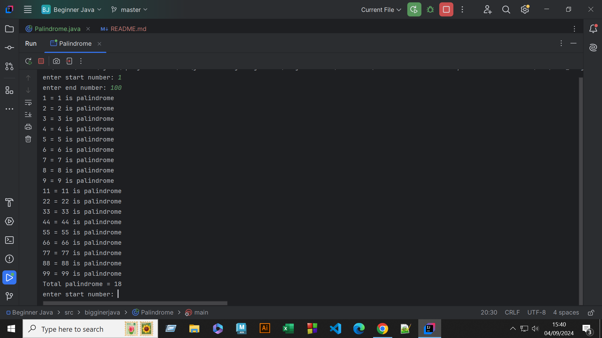
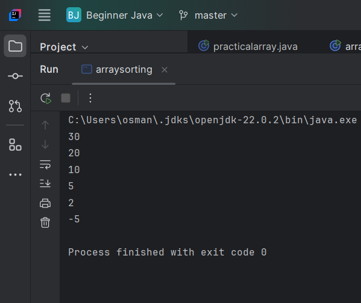

### Palindrome Unlimited
```java
package bigginerjava;
import java.util.Scanner;
public class Palindrome {
    public static void main(String[] args){
        Scanner input = new Scanner(System.in);
        while(true){
        int start,end,num,temp,rem,sum,count=0;
            System.out.print("enter start number: ");
            start = input.nextInt();
            System.out.print("enter end number: ");
            end = input.nextInt();
        for(int i=start; i<=end; i++){
            sum=0;
            temp = i;
            while(temp!=0){
                rem = temp%10;
//                System.out.printf("(%d * 10)+%d = ",sum,rem);
                sum = sum * 10+rem;
//                System.out.println(sum);
                temp=temp/10;
            }
            if(sum==i){
                System.out.printf("%d = %d is palindrome\n",sum,i);
                count++;
            }
            else{
//                System.out.println("not palindrome");
            }
        }
            System.out.println("Total palindrome = "+count);

        }
    }
}

```


### Sorting

```java
package bigginerjava;

public class arraysorting {
    public static void main(String[] args){
        int[] num = {10,20,30,-5,2,5};
        int len = num.length;
        int p;
        int max;
        for(int j=0; j<len; j++){
            max = num[j];
            p=0;
            for(int i=j; i<len; i++){
                if(num[i]>max){
                    max = num[i];
                    p = i ;
                }
            }
            num[p]= num[j];

            num[j] = max;

            System.out.println(num[j]);
        }
    }
}
```
